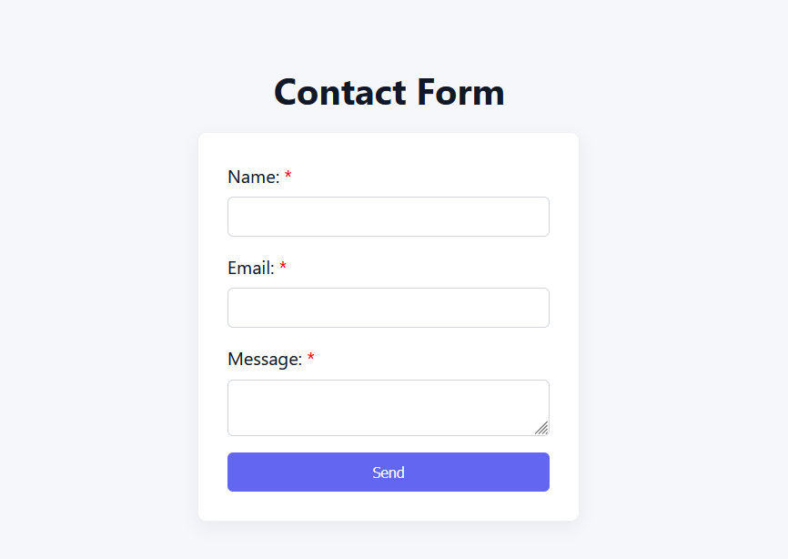
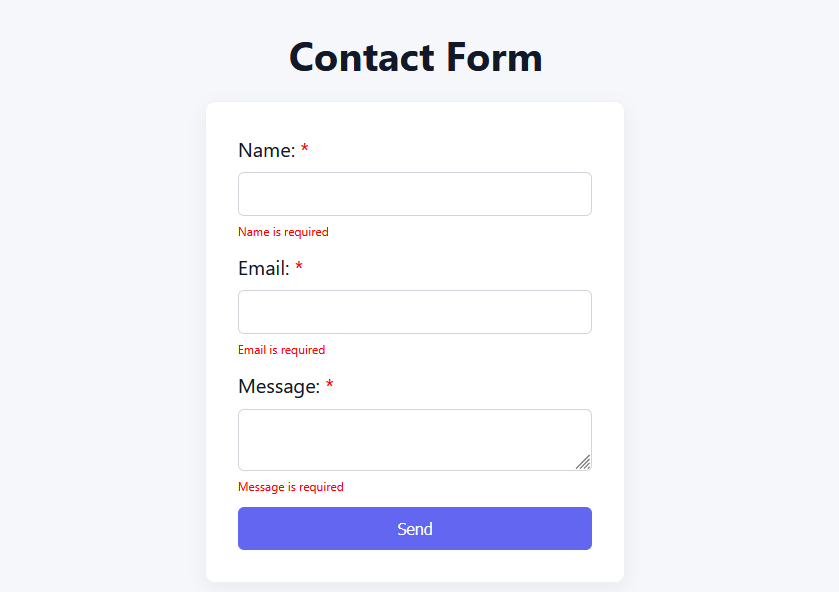
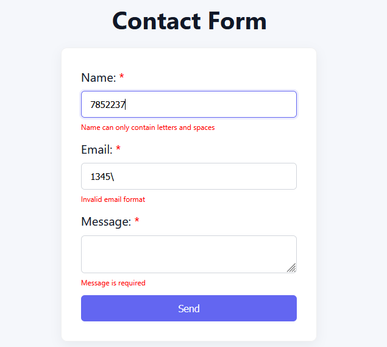
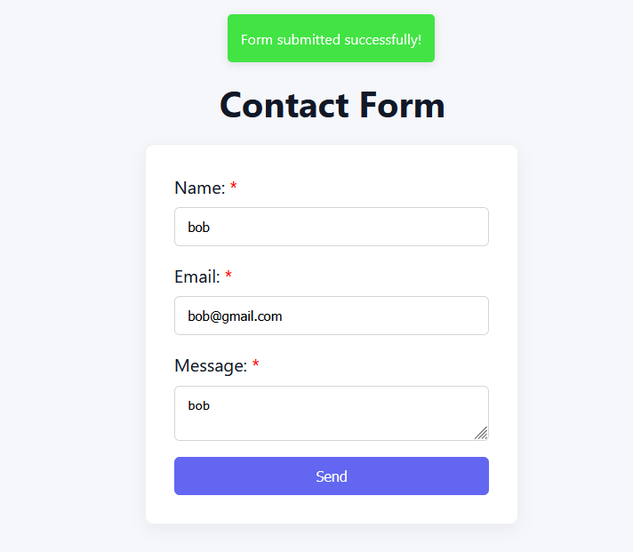

# A2SV Contact Form (React)

A small React project demonstrating how to use the `react-hook-form` `useForm` hook to build a validated contact form. The app contains a simple form (name, email, message), inline validation messages, and a small popup message shown on successful submit.

---

## What this project does

- Renders a contact form that validates input using `react-hook-form`.
- Displays inline validation messages for each field.
- Shows a popup message component when the form is successfully submitted.

## Screenshots

- Main form view:

- Empty Errors view:

- Invalid Errors view:

- Success Pop-up view:

